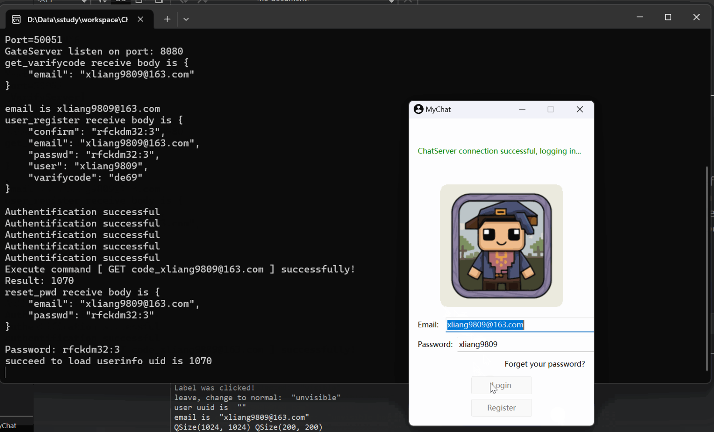

# ChatRoom
Instant messaging project in Linux
## 开发背景
1. 提供高效实时的沟通平台
2. 为管理用户账号实现注册/登录/修改密码功能
3. 为传递信息/实时通讯实现聊天功能

## 环境依赖项
```bash
# boost
sudo apt-get install libboost-dev libboost-test-dev libboost-all-dev

# jsoncpp
sudo apt install libjsoncpp-dev

# hiredis
sudo apt-get install libhiredis-dev

# mysql
sudo apt install libmysqlcppconn-dev

# protobuf & grpc protobuf和grpc版本要对应
# grpc clone以后要先编译protobuf
# 具体参考下面2链接
# https://blog.csdn.net/weixin_36378508/article/details/130600632
# https://developer.aliyun.com/article/819208
```

## 客户端界面展示
### 登录

### 聊天


## 分布式服务端
### GateServer - 网络服务
- 处理http短连接

### StatusServer - 状态服务
- 实现负载均衡

### VarifyServer - 验证服务
- 实现验证码生成及发送逻辑, 验证码可用于账号注册和修改密码

### ChatServer/ChatServer2- 通讯服务
- 与客户端建立tcp长连接
- 实现聊天、添加好友等逻辑


